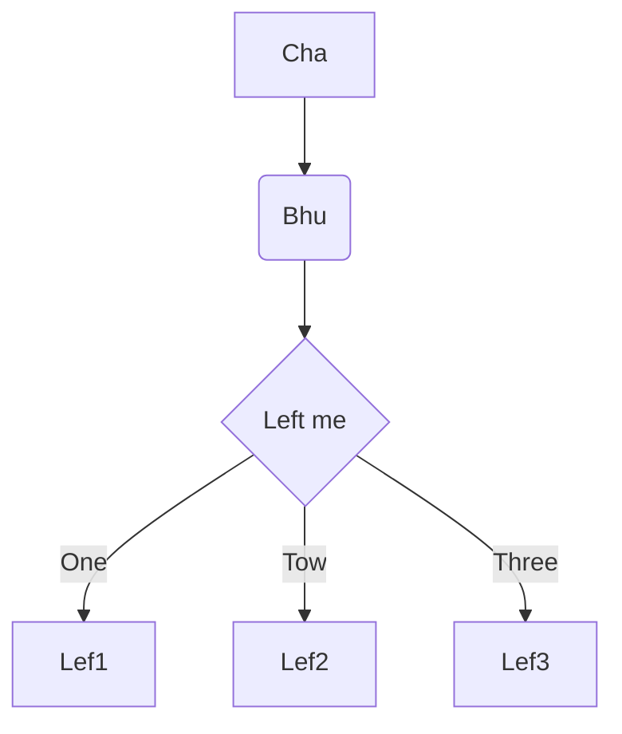

# Dynamic Card

## 背景

当前的card已经不能满足需求越来越定制化，比如在HUC的card当其中一个section的数据全部都为0的时候清除掉兄弟section的显示，而整个card必须是一个dynamic的结构，其中从数据到结构还是显示的各个地方有很多的定制化才能达到的需求，在上一版的结构里面虽然分层坐的很完善，在各个的结构里都可以满足绝大部分的需求，就算是很特殊的需求也可以找到方法来完成，但是在项目迭代的现在，因为内容越来越多，各个部分的代码重复和臃肿的内容越来越多，管理也越来越难，阅读代码也变得越来越难读懂，越来越多和当前的项目结构差别很大的需求需要一个更加直观的结构来容纳

## 基本结构

